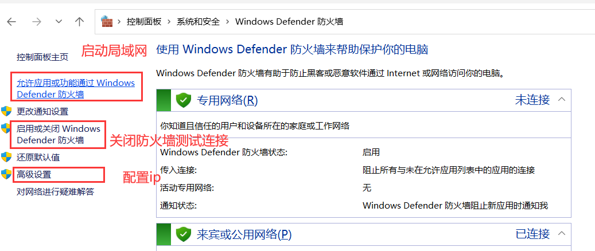
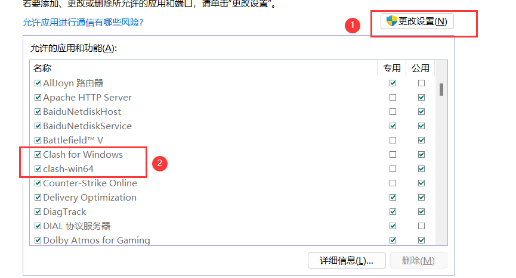
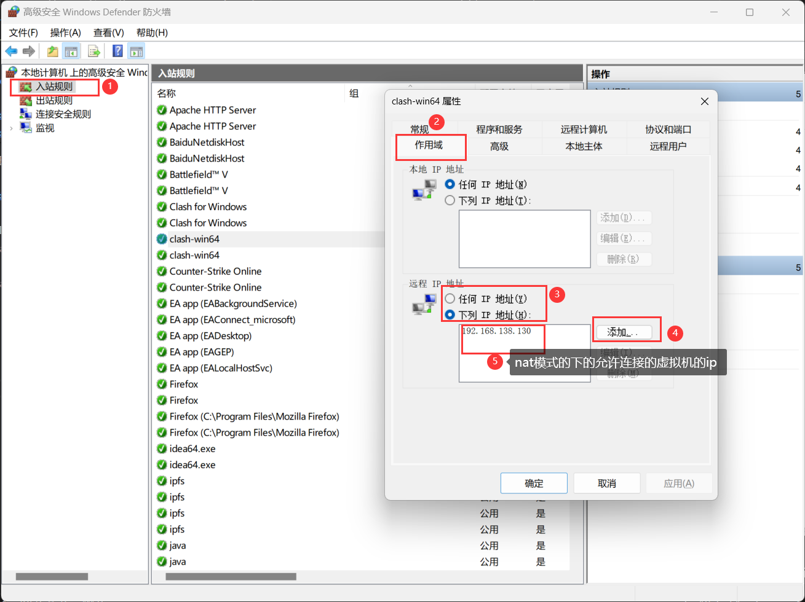

# clash与虚拟机
## 如何让虚拟机连接上物理机的clash，并访问外网
### 首先需要了解vm虚拟机的三种网络模式
1. 桥接模式，虚拟机和主机一样在同一网段下，直接连接主机所连接的网络
2. NAT模式，虚拟机使用主机的虚拟网卡，与主机的虚拟网卡在同一网段下，虚拟机通过主机连接外部网络
3. 仅主机模式，只可以和主机连接，无法连接外网
###  虽然桥接和nat这两种模式都可以使用，但是推荐使用nat模式
1. 桥接的不好的原因是当我们换了一个局域网，ip就会更换，重新设置ip相当麻烦
2. nat使用的是虚拟网卡，在任何时候ip都是一样的
### 下面是设置操作
1. 其次我们要知道clash for windows有允许局域网连接的选项首先将这个选项勾选

2. 设置windows的防火墙（调试的时候，如果连不上，就试着关闭防火墙）

    1. 启动局域网，clash for windows在网络服务里面一共有两个服务，分别是clash fron windows和clash-win64，前面的不知道，后面的是负责局域网的服务，一般是**关闭**的，需要手动启动
    
3. 禁止其他ip访问，禁止同一局域网下的其他机器连接

#### **如果上面的不起效果，则基于端口新建一个入站规则**

**创建入站规则**

1. 在左侧选择 **“入站规则”**。
2. 在右侧点击 **“新建规则”**。

#### **步骤 2.1：选择规则类型**

- 在规则类型窗口中选择 **“端口”**，然后点击 **下一步**。

#### **步骤 2.2：指定端口**

- 选择 **TCP** 或 **UDP**（Clash 的 HTTP 和 SOCKS 代理一般使用 TCP 协议）。
- 选择 **特定本地端口**，并输入 Clash 使用的端口号，例如：
    
    ```
    7890, 7891, 9090
    ```
    
- 点击 **下一步**。

#### **步骤 2.3：选择操作**

- 选择 **“允许连接”**，然后点击 **下一步**。

#### **步骤 2.4：设置规则的应用范围**

- 根据你的网络环境选择：
    - **域**：适用于工作域网络。
    - **专用**：适用于家庭或私人网络。
    - **公用**：适用于公共网络（如咖啡厅 Wi-Fi）。  
        通常建议勾选 **专用** 和 **域**。

#### **步骤 2.5：命名规则**

- 给规则取一个易于识别的名称，例如 **“Clash 入站端口规则”**。
- 点击 **完成**。