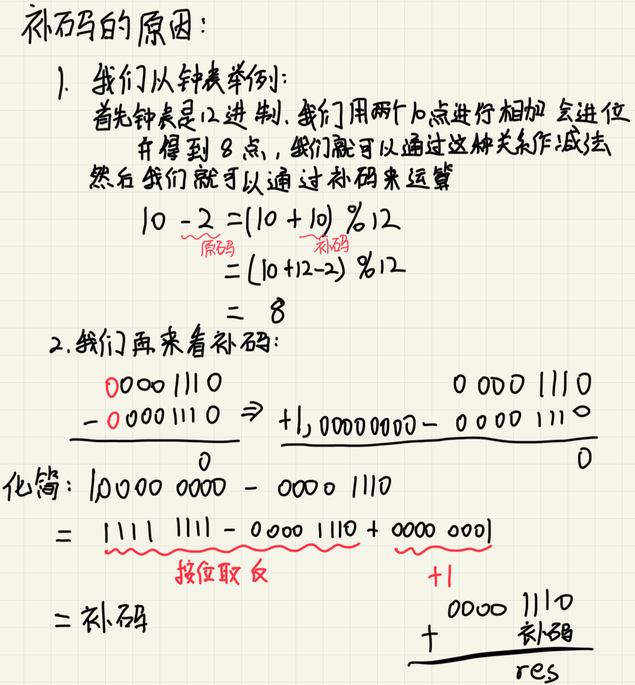
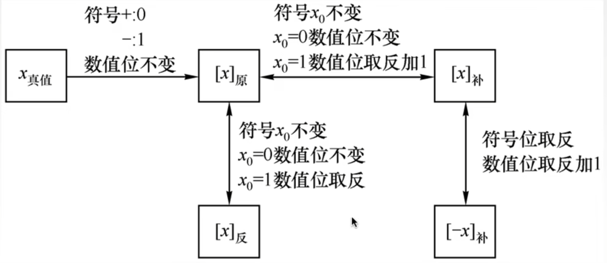
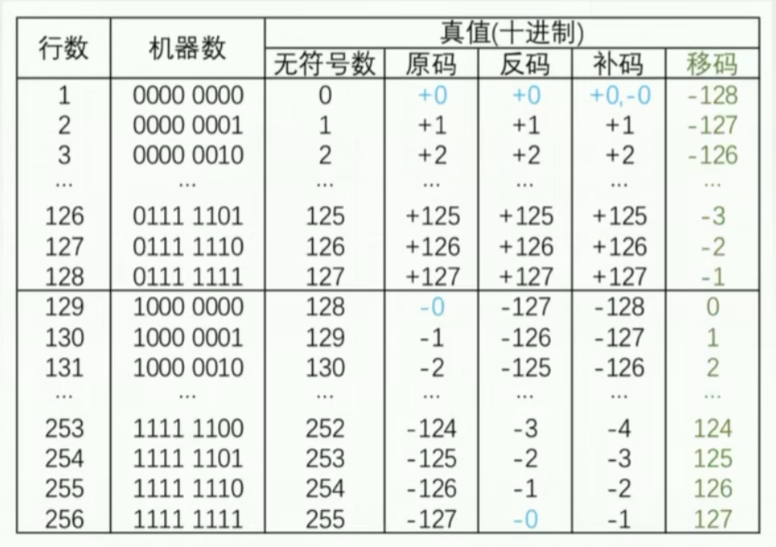

# 第二章

## 定点数

### 2.2.1

#### 表示范围

- 定点小数的表示范围

  - -(1-2^-n^) ~ 1-2^-n^
  - 原一:
    +0.75D = 0.11B 存储为011
    -0.75D = 1.11B 存储为111
    表示范围 -(1-2^-n^)
- 定点整数的表示范围
  
  - -(2^n^-1) ~ 2^n^-1
  - 原因:
    +3D = 011.B 存储为011
    -3D = 111.B 存储为111

#### 原反补码

- 整数补码的公式
  
  - [x]~补~ =
    **0,x  2^n^ > x >= 0
    2^n+1^ + x = 2^n+1^-|x| 0>=x>=-2^n^**
    
    **补充:**
    **mod 2^n+1^**

  - 补码的表示范围
    - 2^n^ ~ 2^n^-1
    - 原因：如果用n(值)+1(符号位)，那么会多出来一位原码是-0，补码是1,000那么，定这个位是-2^n^

- 相反数的补码

  - [-x]~补~ = [x]~补~ 连通符号位一起取反

- 小数补码的公式
  - [x]~补~ =
  **x 1>x>=0**
  **2+x=2-|x| 0>x>=-1**
  - 小数补码的表示范围
    - -1 ~ 1-2^-n^
    - 同理是1.00000代替了-1这个位置
- 理解
  
- 原返补的深度理解与移码
  
- 补码到移码
  符号位取反
