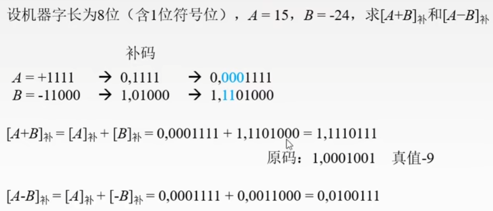
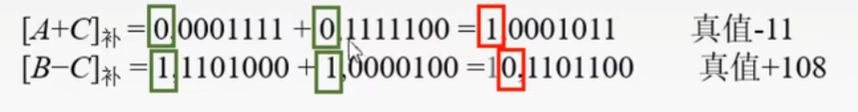
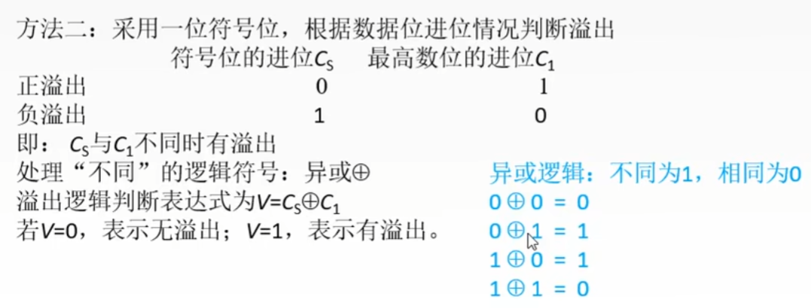
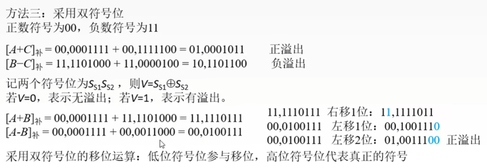

# 2.2

## 加减运算

### 2.3.4

#### **两个补码相加的运算过程**

##### 注

- **[A+B]~补~** 可以变成 **[A]~补~** + **[B]~补~**
- **[A-B]~补~** 可以变成 **[A]~补~** + **[-B]~补~**
- **[B]~补~** 变成 **[-B]~补~** 需要包括符号位取反加一
- 补码相加，**进位需要进到符号位上**
- 符号位上两个**1**相加，结果的符号位变成了**0**

#### **溢出判断**

采用符号位判断是否溢出

##### 方法1

采用符号位来判断

****

公式：
*V = A~s~B~s~$\overline{S~s~}$ + $\overline{A~s~}$ $\overline{B~s~}$ S~s~*

- v = 0表示无溢出，v = 1表示有溢出
- A~s~是A的符号位，B~s~是B的符号位，S~s~是结果的符号位

****

##### 方法2

通过符号位进位和最高位进位来判断

****

****

##### 方法3

采用双符号位来判断
*这个与方法二并无很大的差别*
****

****

- 正溢出是从正数溢出，变成负数
- 负溢出时从负数溢出，变成正数
- 双符号位的右位表示符号
