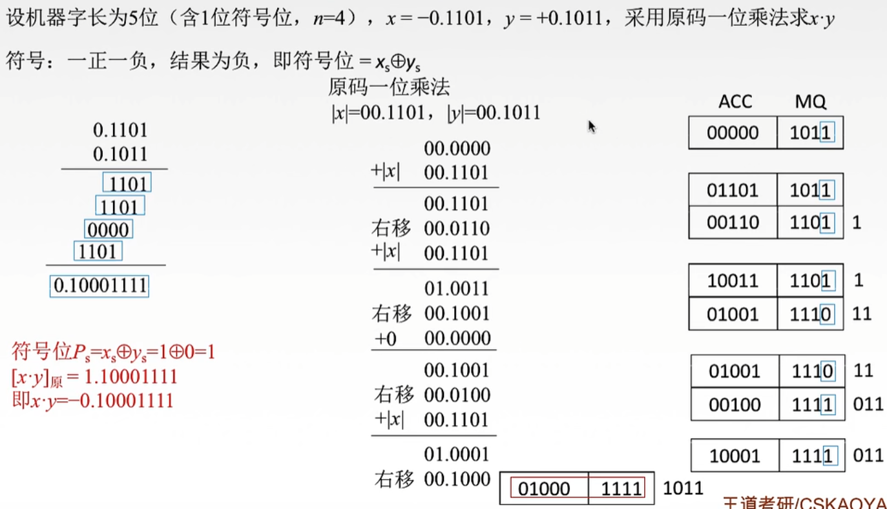
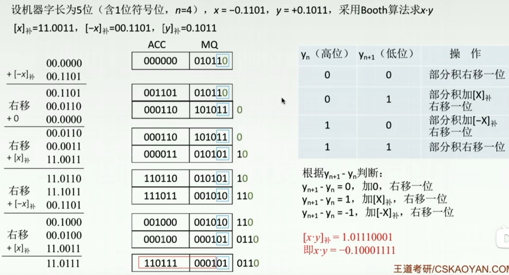

# 第二章

## 2.3.5

### 原码的乘法运算

概括：准备额外的一个空间，将存放原来数字的空间与额外空间组合形成一个新空间（额外空间在前面），加出结果，原空间向右移位，将结果放到额外空间里面，重复此操作，直到成完全部的结果

### 补码的乘法运算

概况：原理与原码的乘法运算并没有本质区别，但是补码的乘法运算里面的循环是根据最后两位来判断当前循环应该如何进行

### 强制类型转换

short 负数 赋值给 int，存储的是补码，前面补1
