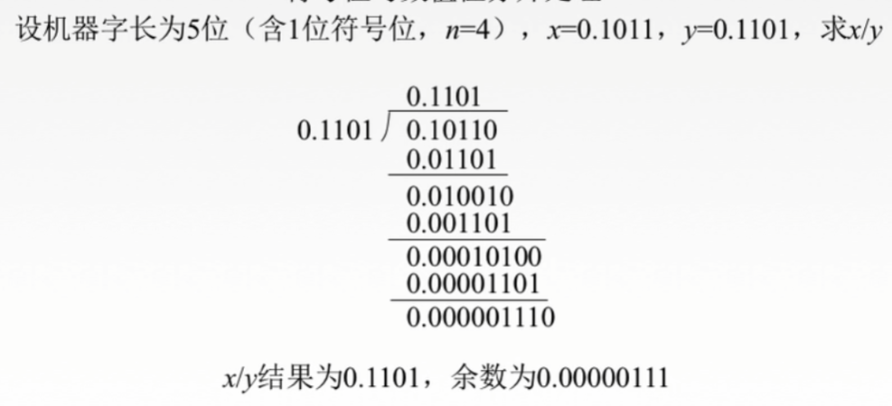
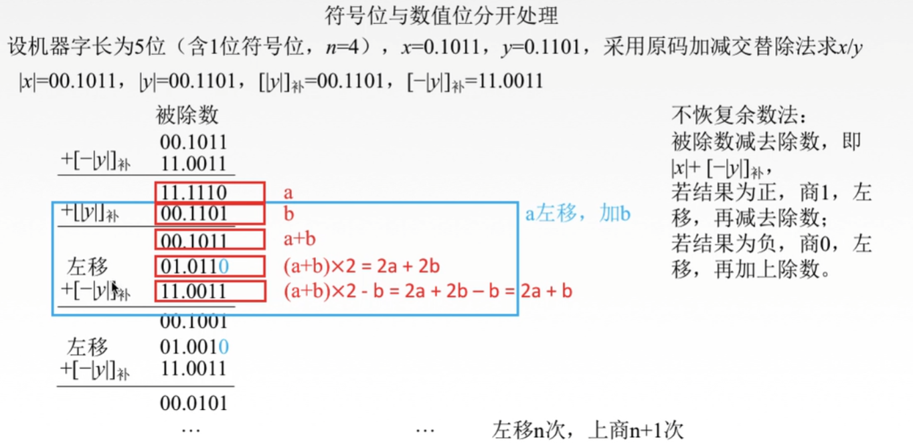

# 第二章

## 2.2.7

### 除法运算

#### 二进制除法原理

概括总结：

- 当前的被除数是否大于除数，如果大于那就减去除数，拿到结果，并且商1，如果小于除数，那就保持原数，就是结果，并且商0。
- 结果是否大于除数\*0.1，如果大于那就减去除数\*0.1，拿到结果，并且商1，如果小于除数，那就保持原数，就是结果，并且商0
- ...

#### 原码恢复余数法

概括总结：

- 与上面的二进制除法并没有太大的差别，但是在计算机里面没有办法让除数数位一直乘0.1增加，只能让被除数左移来变化
- 还有一个差别就是，在人类计算过程中是可以通过目测来判断大小的，但是计算机没有办法目测，只能通过直接相减的方式，通过结果来判断是否大于小于。
- 所以这里我们先直接减去除数，如果结果是负数，那就商0，然后把数补回来（加上除数），然后被除数左移一位，如果是正数，那就上1，进行下一次循环

注（红框与篮框）:

- 如果不够，那就补回去，再左移，再减，完全可以变成一个新的步骤，那就是先进性左移再加上补
