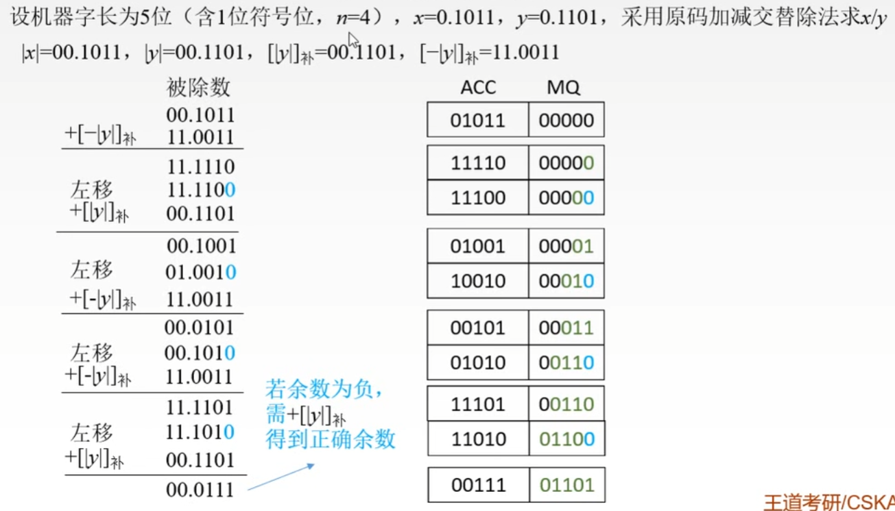
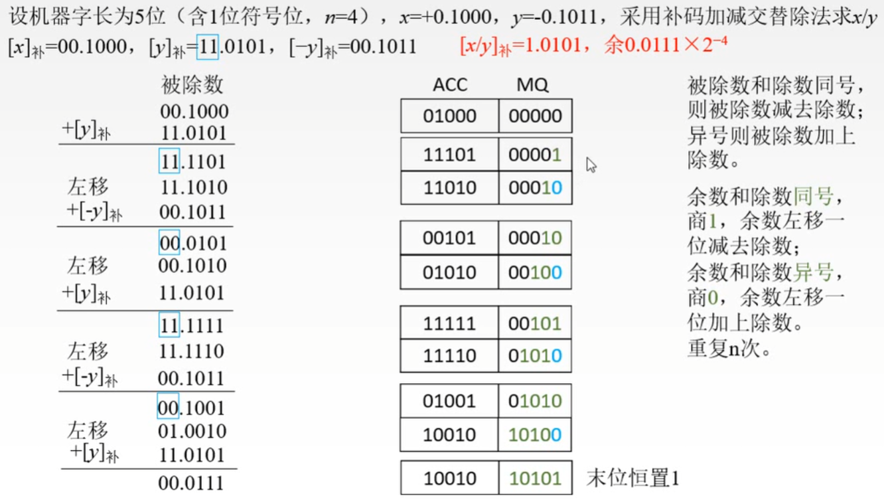

# 第二章

## 2.2.7

### 原码不恢复余数法

概括：这与除法并没有本质区别，只是将原来的步骤进行改良，比如将补回去与下一步进行合并，得到的就是新步骤的结果

- 原码最后只取绝对值

### 补码相除

概括：原理与上面相同，执行步骤有差异

- 被除数与除数同号，被除数减去除数，异号就加上
- 余数与除数同号，商1，余数左移一位减去除数
- 异号商0，余数左移加上除数
- 循环

