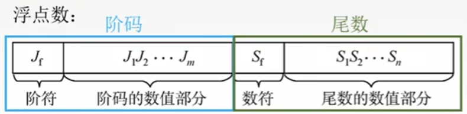
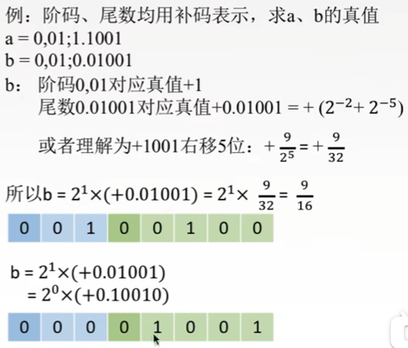
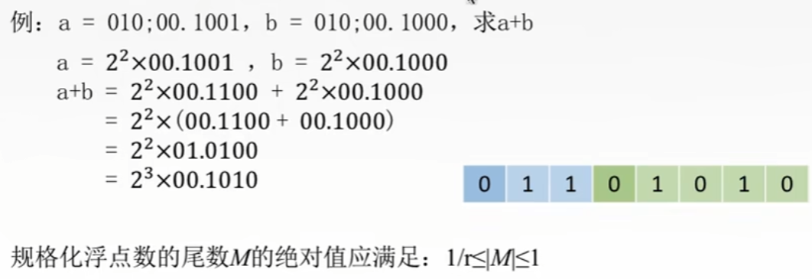
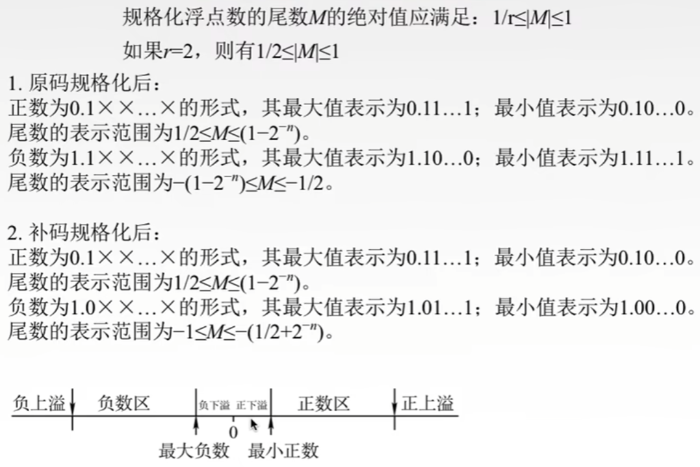

# 第二章

## 2.3.1

### 浮点数表示

概述总结：浮点数将小数转换成为两个部分，一个是阶码，另外一个是尾数。

`科学计数法:` 2 * 10^2^

浮点数就是这么表示
**浮点数公式：N = r^E^ * M**

- r通常为2
- E为**阶码**(常用补码或移码表示)
  - E反映浮点数的表示范围基小数点的实际位置
- M为**尾数**(常用原码或补码表示)
  - 尾数M的数值部分的位数n反映了浮点数的精度

`例子：`

### 规格化

定义：规定尾数最高的位数必须是一个有效位

- 左规：当尾数前面有0时，尾数前移，阶数加数
- 右规：当浮点数相加溢出，尾数后移，结束减数

`例子`

### 浮点数规格化后范围

`少废话上图`

