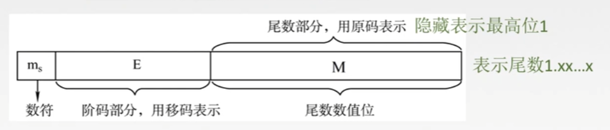

# 第二章

## 2.3.2

### IEEE 754 标准

- 最高位为数符
- 阶码用移码表示
- 尾数用原码表示
- 隐含表示数值最高位1

`演示`

注意，其他的都是一些记忆性质的东西，如果需要更加详细的资料，请看原视频，或请网络上面搜索
[原视频](https://www.bilibili.com/video/BV1BE411D7ii/?p=55&vd_source=d3ea9fa6b291ac6cd33aae43110b598e)
