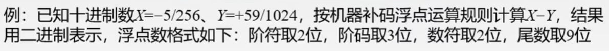
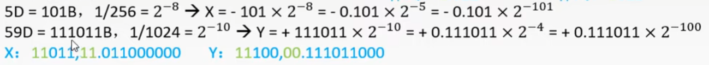
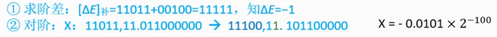
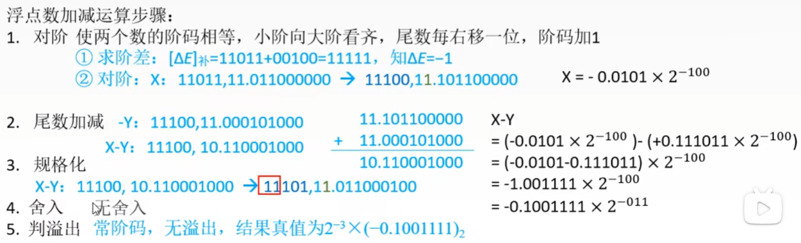
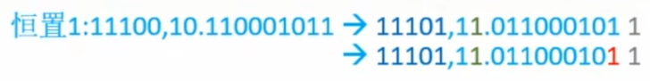

# 第二章

## 2.3.3

### 浮点数的加减运算

`例子:`

#### 解题步骤&#58;

   1. 转换格式。根据题目要求将数据转换。

      - 阶符的意思是指数的符号，数符是尾数的符号
      - 将题目中的x、y转换成为原码
        
  
   2. 对阶。规则：让两个输的阶码相等，小阶向大阶看齐，尾数没移动一位，阶码加一。
        
   3. 尾数计算。当前溢出不是真正的溢出
   4. 规格化。规格化之后溢出才是真正的溢出
   5. 舍入
   6. 判溢出
   

#### 舍入

##### 0舍1入法

类似于四舍五入，这样会再次溢出，如果溢出的话，就在次递归

##### 横置0法

尾数右移的时候，无论丢掉的最高位是0还是1，右移都置1

