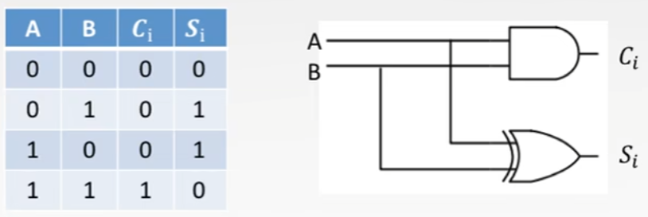
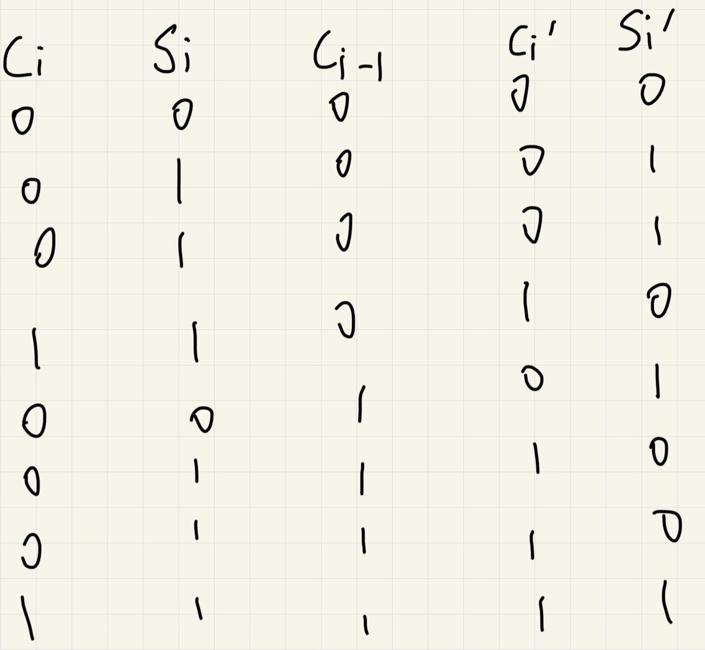

# 第二章

## 2.4.2

### 加法器设计

#### 一位全加器

##### 不进位相加，逻辑结构与真值表

##### 进位相加

###### 真值表

###### 逻辑结构

C~i~ = G~i~ + P~i~ C~i-1~

###### 逻辑表达式

#### 串行加法器

定义：只有一个全加器，数据逐位串行送入加法器中进行运算。进位触发器用来寄存进位信号，一边用来参与下一次的运算。

#### 并行加法器

定义：把n格全加器串接起来，就可以进行两个n为数的相加

#### 衍生加法器

