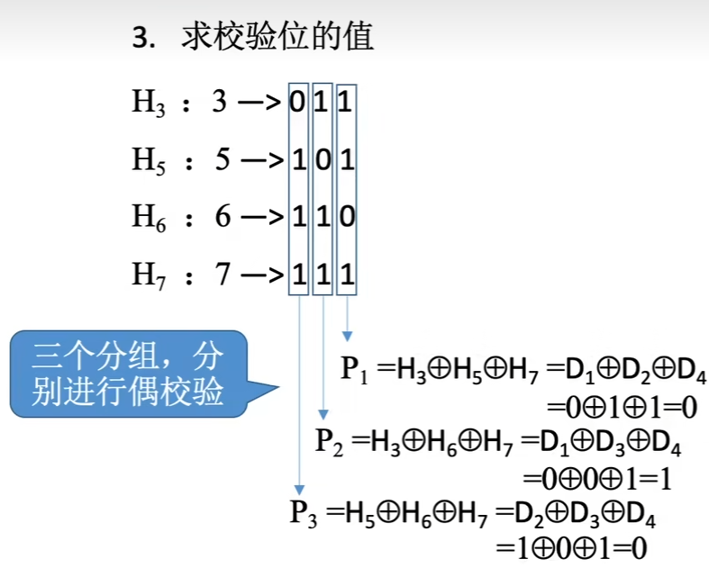
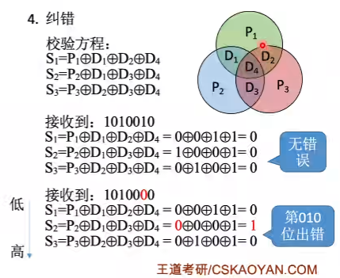
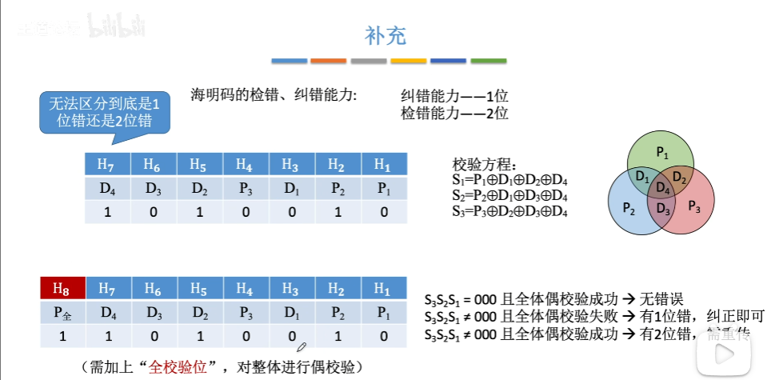

# 第二章

## 校验原理

- 码字：由若干位代码组成的一个字。
  - 如果编码一共有3位，但是只有其中的四个有对应的信息，其他的四位没有对印的信息，那其他4个就是非法状态，就是4个冗余的非法状态。
- 两个码字间的距离：将两个码字逐位进行对比，具有不同的位的个数。
- 码距（简写为d）：一种编码方案可能具有若干个合法的码字，各合法码字间的最小距离。
  - 当d == 1时，无检错能力；当d == 2时，有检错能力；d==3，若设计合理，有检错，纠错能力

## 奇偶校验

### 奇校验码

- 解释：整个校验码中'1'的个数时奇数。

  ```c
  如果我们的信息位是奇数，我们的校验位就是0
  如果我们的信息位是偶数，我们的校验位就是1
  ```

### 偶校验码

- 解释：整个校验码中'1'的个数时偶数。

  ```c
  如果我们的信息位是奇数，我们的校验位就是1
  如果我们的信息位是偶数，我们的校验位就是0
  ```

- 偶校验的硬件实现（求偶校验位）：各信息位进行异或（模2加）运算，得到的结果就是偶校验位。

- 偶校验位校验：对所有的位进行异或，如果为1，说明出错。

### 海明校验码

- 解释：将信息位分组进行偶校验 --> 多个校验位 --> 多个校验位标注出错位置

- 信息位：n，校验位：k。一共有2^k^ 种状态                                    == > 所以必须满足 2^k^ >= n + k + 1

  ​            信息位 + 校验位一共有n + k 位状态   == >                           n + k个纠错位，1种正确状态

- 确定校验位分布

  - 分布规律：校验位p~i~放在海明位号2^i-1^的位置上，信息位按顺序放到其余位置上

    |  H7   |  H6   |  H5   |  H4   |  H3   |  H2   |  H1   |
    | :---: | :---: | :---: | :---: | :---: | :---: | :---: |
    |  D4   |  D3   |  D2   |  P3   |  D1   |  P2   |  P1   |
  
- 求校验位：将所有的信息位的下标从小到大依次数值排列，并转换成位二进制数字，p~i~就是在第i位上所有的1表示在求当前的p~i~是否用到当前的D，所有的1所对应的信息位都拿去异或。
  
  
- 纠错：将p~i~与得到pi的那些D~i~进行异或，就能得到S~i~，将每一个S~i~从小到大进行排布，如果为0，那么就无错误，如果得到了数字，那么这个数字位置上就是出错的位置

  

- 补充：全校验位，如果有1位出错，纠正，如果有两位出错，重传
  

### 循环冗余校验码

- 思想：数据发送、接受放约定一个“除数”。
